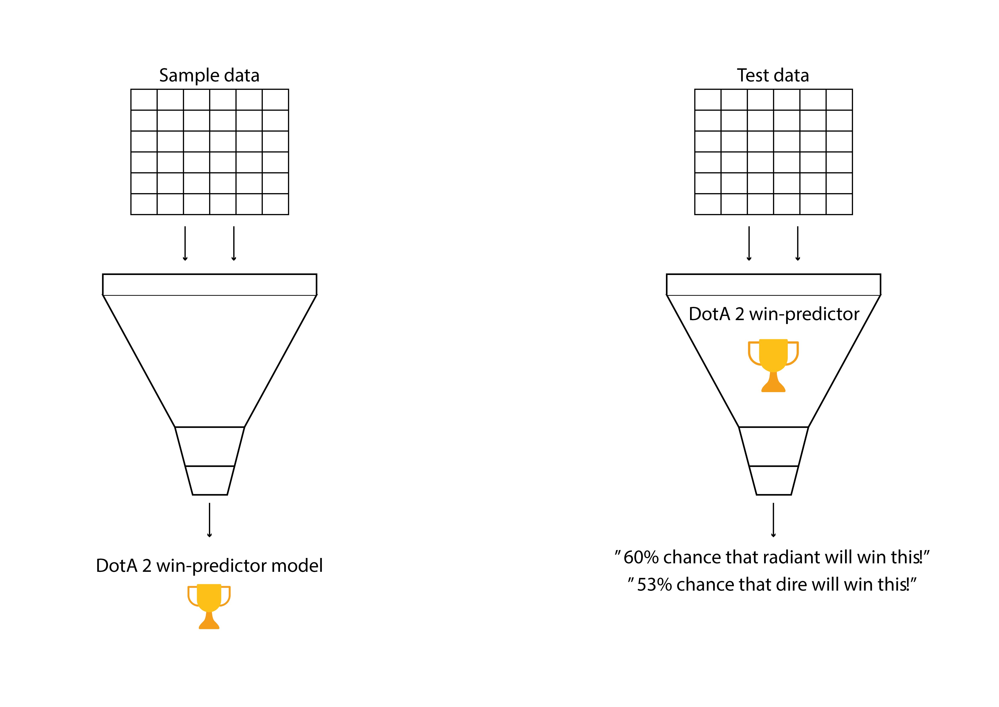

# A win predictor for DOTA 2
#### A project created by Edgar Peña, Mikki Seidenschnur & Regina Hunter
##### Data obtained from [Opendota's API](https://docs.opendota.com/)

Ironhack data bootcamp in Berlin 12-07-2020

This repository contains:
* /data (hero data including random sample data)
* /matchesdata (data obtained by runnning main.py)
* /notebooks (code based of Jupyter notebook)
* /rawdata (random match miner without data cleaning)
* /source (scripts for running main.py data miner)
* .gitignore
* License
* README.md
* main.py

#### 1. What is DOTA 2?
The best person to answer that question is the famous "get started with DOTA 2" youtuber Purge. See [this](https://www.youtube.com/watch?v=9Szj-CloJiI) short video to become enlightened! ;)

#### 2. Problem description
The DOTA 2 community also seem to agree that counter picking is a massive part of the game. The community seem to come back to this point over and over again [counterpicking](https://www.reddit.com/r/learndota2/comments/6im5if/counterpickingdrafting_does_it_actually_matter_at/). 

Over the years, a multitude of DOTA 2 "drafting clients" have come on the market. A few examples are [dota2freaks](https://dota2freaks.com/drafting/), [dotapicker](http://dotapicker.com/counterpick), & [overwolf](https://www.overwolf.com/). All of these clients heavily rely on match data, but also make predictions on a vast amount of parameters, and not only the draft. These drafting clients have become extremely complicated and are not transparent on how they make their predictions.

Therefore, in this case, we would like to create a simple win predictor, that can tell the winrate of one team over the other, simply by looking at a specific matchup.

#### 3. Hypothesis
By knowing the draft of a DOTA 2 match, it should be possible to predict the given outcome of said match.

#### 4. Overview
Below image displays the overall tasks in the project. We need two data sets in order to create our win predictor. The first data set should be the "sample" data set, from where we will compute the probability of one hero winning over another.

##### 4.1 Webscraping match_id's
In order to get the sample data, we needed to have the match id's that we wanted to request from the [Opendota API](https://docs.opendota.com/#tag/matches). Therefore, we scraped [the opendota site](https://www.opendota.com/explorer?minDate=2020-06-12T17%3A10%3A30.924Z) for match id's all the way back to January 1 2020. This amounted to a list of 21253 dota 2 matches that including proffesional DOTA 2 players.

##### 4.2 Requesting matches from opendota API
Following the previous step, we needed to request each match id from the [Opendota API](https://docs.opendota.com/#tag/matches). In the opendota API, we were limited to only requesting one match per second. This meant that the script needed a sleep timer on the request of 1-2 seconds. This was a process that took around 1-2 days of running the script as we needed 21253 matches.

##### 4.3 Getting random data samples
The random sample data was retrieved with a get request on [Opendota API](https://docs.opendota.com/#tag/public-matches). This data consisted of around 350 matches. 

##### 4.4 Data wrangling and counting wins of hero-vs-hero matchups

##### 4.5 Creating a combined winrate for a team

#### 5. Results
Show the results here

#### 6. Discussion/conclusion
* Sample data retreived from the high elo matches not representative since pro players don't draft badly
* Skill level of pro players make the difference in high elo matches
* For further research it should 

#### 7. Ideas of further work

#### 8. Links
1. Data mining 
2. Filtering (MMR)
3. Counts
4. Combined win rate
5. Model testing
# Team Tasks
Mikki - Created Trello, Filtering
Edgar - Data Mining
Regina - Counts