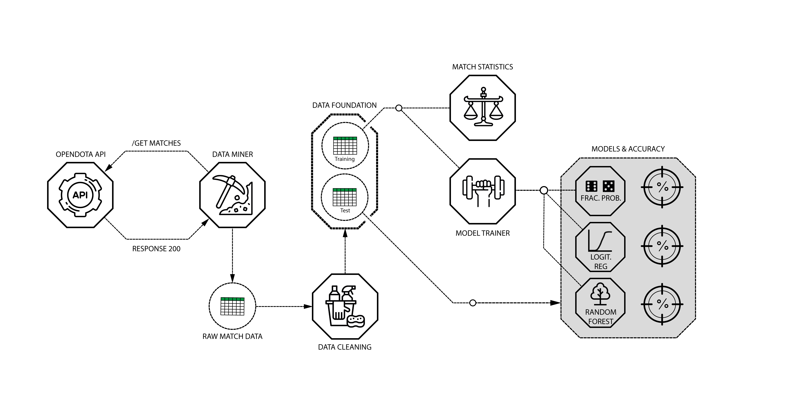
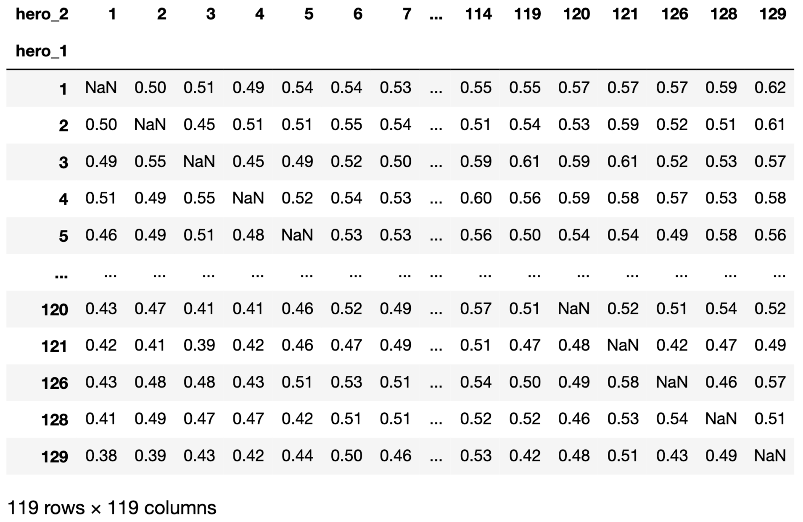
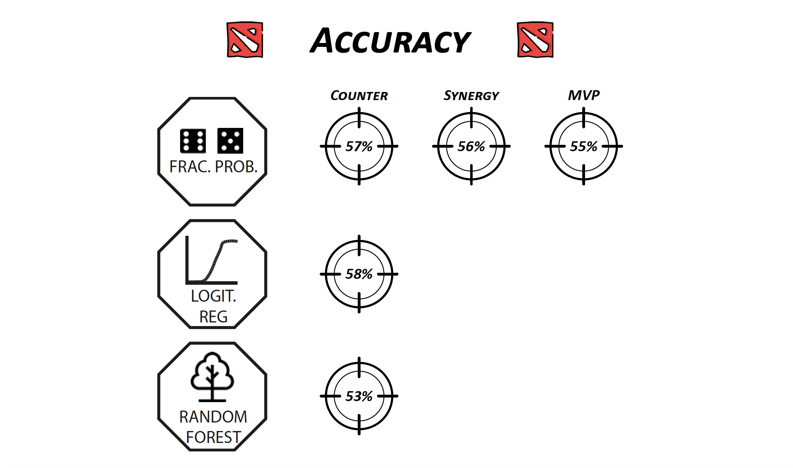

# A win predictor for DOTA 2
#### A project created by Mikki Seidenhscnur
##### Contributors: Edgar Peña, Regina Hunter
##### Data obtained from [Opendota's API](https://docs.opendota.com/)

Ironhack data bootcamp in Berlin 31-07-2020

This repository contains:
* /data (hero data including random sample data)
* /notebooks (code based of Jupyter notebook)
* /source (python modules)
* .gitignore
* LICENSE
* README.md

#### 1. What is DOTA 2?
The best person to answer that question is the famous "get started with DOTA 2" youtuber Purge. See [this](https://www.youtube.com/watch?v=9Szj-CloJiI) short video to become enlightened! ;)

The presentation presented on the August 31 2020, can be found on [this link](https://www.dropbox.com/s/kknllttflu884jw/01_presentation_win_predictor.pdf?dl=0)

#### 2. Problem description
The DOTA 2 community also seem to agree that counter picking is a massive part of the game. The community seem to come back to this point over and over again [counterpicking](https://www.reddit.com/r/learndota2/comments/6im5if/counterpickingdrafting_does_it_actually_matter_at/). 

Over the years, a multitude of DOTA 2 "drafting clients" have come on the market. A few examples are [dota2freaks](https://dota2freaks.com/drafting/), [dotapicker](http://dotapicker.com/counterpick), & [overwolf](https://www.overwolf.com/). All of these clients heavily rely on match data, but also make predictions on a vast amount of parameters, and not only the draft. These drafting clients have become extremely complicated and are not transparent on how they make their predictions.

Therefore, in this case, we would like to create a simple win predictor, that can tell the winrate of one team over the other, simply by looking at a specific matchup.

#### 3. Hypothesis
By knowing the draft of a DOTA 2 match, it should be possible to predict the given outcome of said match.

#### 4. Overview/architecture
Below image displays the overall tasks in the project. We need two data sets in order to create our win predictor. The first data set should be the "sample" data set, from where we will compute the probability of one hero winning over another.

##### 4.1 Using the opendota API to get match data
The opendota API has a "explorer" that takes URL requests in SQL format to their database. In this way 300.000 training matches and 30.000 test matches were provided for training and test the models [Opendota API](https://docs.opendota.com/#tag/matches)

#### 4.2 Counting the picks of each hero
The least picked hero was picked 900 times. Therefore it is meant to be a representative dataset with plenty of sample points to speak to the general trends of the data.

Furthermore, we counted all the heroes against each other, and created a 119x119 pivot table that shows the winrate for all possible hero matchups, as seen below:

#### 5. Results/Discussion
Finally we used our win predictor on the test data, as shown in the below image:

Above images shows that the winpredictor predicts 58% of the matches outcome correctly with the logistic regression made with the feature sets of the fractional probabilities. While it consistently does 58% accurately, there are some ways believed to make it better

* Add the players skill level on the hero as a weight when considering their synergy and counter mechanisms

It seems that there might be some truth to the hypothesis that the win predictor can predict the outcome of the match based on the draft. However, in future works, explanatory features for increased model precision should be explored.

#### 6. Links
* [What is DOTA2?](https://www.youtube.com/watch?v=9Szj-CloJiI)
* [Opendota API](https://www.opendota.com/api-keys)
* [Opendota scraping site](https://www.opendota.com/explorer?minDate=2020-06-13T07%3A39%3A52.077Z)
